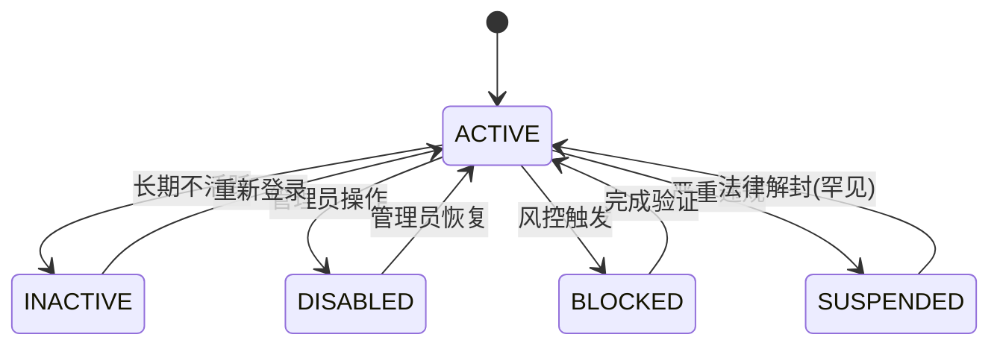

# 数据状态

## 状态字典

| 值  | 英文名称           | 中文名称        | 说明                                                                         |
|----|----------------|-------------|----------------------------------------------------------------------------|
| 10 | DRAFT          | 草稿          | 未正式提交、可编辑的临时状态，通常用于需要多次修改才能正式提交的数据记录                                       |
| 11 | PENDING        | 待处理/待审核/待确认 | 已提交但未处理，需等待系统/人工操作（如审核、支付、验证）                                              |
| 20 | APPROVED       | 已批准/已通过/已授权 | 通常为审核流程的终态，需经过系统或人工的**正式确认**。**对立状态**：`REJECTED`、`PENDING`                 |
| 22 | ACTIVE         | 活跃          | 已生效，可正常使用（如已支付订单、已认证用户）                                                    |
| 23 | SUCCESS        | 成功          | 处理成功                                                                       |
| 26 | PUBLISHED      | 已上架         | 可公开销售                                                                      |
| 27 | UNLISTED       | 已下架         | 	临时停止销售                                                                    |
| 30 | PAID           | 已支付         | PAID 是业务系统中表示支付已完成的核心状态，主要应用于订单、交易、订阅等涉及支付的业务场景                            |
| 31 | PARTIAL_PAID   | 部分支付        | 支付系统中的特殊状态，表示订单或交易只完成了部分金额的支付，常见于分期付款、定金尾款等场景                              |
| 36 | REFUNDED       | 已退款         | 全额退款完成                                                                     |
| 37 | PARTIAL_REFUND | 部分退款        | 部分商品/金额退款                                                                  |
| 40 | SHIPPED        | 已发货         | 物流已发出（含物流单号）                                                               |
| 41 | DELIVERED      | 已送达         | 物流显示签收（可能未实际收货）                                                            |
| 50 | PROCESSING     | 处理中/进行中     | PROCESSING 是业务系统中表示请求已接收并正在处理，但尚未完成的中间状态，通常出现在异步操作、支付、工单系统等需要时间执行的场景       |
| 70 | CANCELLED      | 已取消         | 业务系统中表示**用户或系统主动中止流程**的终止状态，与自动触发的终止状态（如`EXPIRED`/`TERMINATED`）不同，强调主观取消行为 |
| 71 | FAILED         | 失败          | 系统中最常见的终结状态之一，表示某个操作或流程因意外情况未能完成，通常需要错误处理机制介入                              |
| 72 | REJECTED       | 被拒绝         | 系统中表示**请求或操作因不符合规则被明确拒绝**的终结状态，强调业务规则层面的否定判断，通常需要给出具体拒绝原因                  |
| 74 | LOCKED         | 锁定          | 安全原因临时限制                                                                   |
| 75 | INACTIVE       | 非活跃         | 表示资源或账户处于休眠状态但数据完整保留的中间状态，通常由不活跃触发而非主动禁用                                   |
| 76 | DISABLED       | 已禁用         | 管理员或用户主动限制                                                                 |
| 77 | FROZEN         | 冻结          | 表示**资源或账户被临时锁定且保留数据的特殊状态**，介于活跃状态与永久终止状态之间                                 |
| 88 | COMPLETED      | 已完成/已完结     | 流程的最终状态（不可再自动流转）                                                           |
| 90 | EXPIRED        | 已过期         | 系统中表示超过有效期限自动失效的终止状态，通常用于有时间限制的业务场景，由时间条件自动触发（非人工操作）                       |
| 92 | BLOCKED        | 已封锁         | 系统自动防护机制，由风控规则自动触发，需要额外验证才能解除，通常记录安全日志                                     |
| 93 | DELETED        | 软删除         | 逻辑删除，通常不再显示给用户，只能通过管理员恢复                                                   |
| 95 | ARCHIVED       | 归档          | 归档状态，数据已移动到历史库，业务系统不再使用                                                    |
| 97 | SUSPENDED      | 临时冻结        | （罕见）最高级别的强制措施，针对严重违规或法律要求                                                  |
| 99 | TERMINATED     | 已终止         | （罕见）已终止/永久关闭，**不可逆性**：无法通过常规手段恢复，**触发方式**：人工执行或自动合同到期                      |

## SUSPENDED、BLOCKED、DISABLED、INACTIVE 状态对比与严重程度分析

这四种状态都表示某种形式的"非活跃"状态，但在业务含义、严重程度和恢复方式上有显著区别。以下是详细对比：

### 1. 严重程度排序（从轻到重）

```
INACTIVE（轻度） → DISABLED → BLOCKED → SUSPENDED（最严重）
```

### 2. 详细状态对比表

| 状态        | 触发方    | 可逆性 | 典型场景        | 恢复方式       | 数据可见性 |
|-----------|--------|-----|-------------|------------|-------|
| INACTIVE  | 系统/用户  | 高   | 长期未登录自动休眠   | 用户自行激活     | 通常不可见 |
| DISABLED  | 管理员    | 中   | 违反社区规则      | 管理员手动启用    | 部分可见  |
| BLOCKED   | 系统规则   | 中低  | 风控触发/多次失败尝试 | 需验证或人工审核   | 完全不可见 |
| SUSPENDED | 管理员/系统 | 低   | 严重违规/法律风险   | 需高层审批或法律解封 | 完全隐藏  |

### 3. 各状态深度解析

#### (1) INACTIVE（非活跃）

- 本质：温和的休眠状态

- 特点：

  通常由不活跃触发（如6个月未登录）

  数据完整保留

  用户可自行恢复

#### (2) DISABLED（已禁用）

- 本质：管理员主动限制

- 特点：

  通常因轻度违规

  保留数据但功能受限

  需后台操作恢复

- 示例场景：

  用户发布垃圾内容被禁言

  商家未按时缴纳服务费

#### (3) BLOCKED（已封锁）

- 本质：系统自动防护机制

- 特点：

  由风控规则自动触发

  需要额外验证才能解除

  通常记录安全日志

#### (4) SUSPENDED（已停权）

- 本质：最高级别的强制措施

- 特点：

  针对严重违规或法律要求

  可能需要数据删除

  恢复需法律流程

### 4. 状态转换关系图



### 6. 恢复流程对比

| 状态        | 自助恢复 | 客服处理 | 管理员审批 | 法律流程 |
|-----------|------|------|-------|------|
| INACTIVE  | ✅    | ❌    | ❌     | ❌    |
| DISABLED  | ❌    | ✅    | ✅     | ❌    |
| BLOCKED   | ⚠️   | ✅    | ✅     | ❌    |
| SUSPENDED | ❌    | ❌    | ❌     | ✅    |

### 7. 最佳实践建议

避免混用`BLOCKED`和`SUSPENDED`，后者应保留给最严重情况